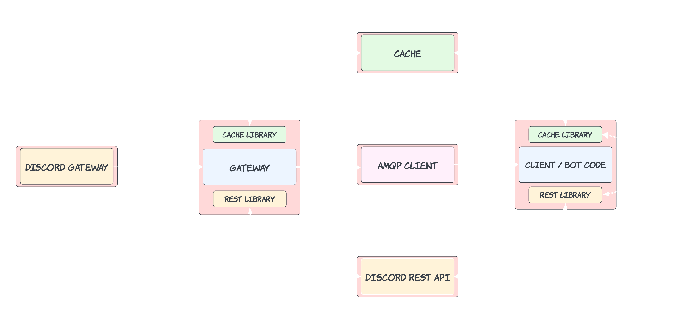

---

title: Microservice Discord Bots
date: 2023-12-15
Lorem Ipsum Lorem Ipsum Lorem Ipsum Lorem Ipsum Lorem Ipsum Lorem Ipsum Lorem Ipsum Lorem Ipsum Lorem Ipsum Lorem Ipsum Lorem Ipsum Lorem Ipsum Lorem Ipsum Lorem Ipsum Lorem Ipsum Lorem Ipsum Lorem Ipsum Lorem Ipsum Lorem Ipsum Lorem Ipsum Lorem Ipsum Lorem Ipsum Lorem Ipsum Lorem Ipsum Lorem Ipsum Lorem Ipsum Lorem Ipsum Lorem Ipsum Lorem Ipsum Lorem Ipsum Lorem Ipsum Lorem Ipsum Lorem Ipsum Lorem Ipsum Lorem Ipsum Lorem Ipsum Lorem Ipsum Lorem Ipsum Lorem Ipsum Lorem Ipsum Lorem Ipsum Lorem Ipsum Lorem Ipsum Lorem Ipsum Lorem Ipsum Lorem Ipsum Lorem Ipsum Lorem Ipsum Lorem Ipsum Lorem Ipsum Lorem Ipsum Lorem Ipsum Lorem Ipsum Lorem Ipsum Lorem Ipsum
---

# Microservice Discord Bots

In recent years, the Discord platform has been exploding in popularity - attracting thousands of different of communities from around the world. This has been made even more special by the platform's outstanding API, which allows for easy integration and creation of 3rd party apps, 'bots'. This has given rise to thousands of apps, each offering different functionalities and features, and many using traditional libraries such as **discord.js** and **discord.py**

However, these historically popular libraries are hugely limited when it comes to **scalability**, and accessing data from outside of the application - for example for use in a dashboard. After reading Das Wolke's White Paper on Microservice Bots, I was drawn to investigate the possible implementations of a scalable, and efficient package to work with Discord.

## Discord Developer Introduction

### Discord Gateway

